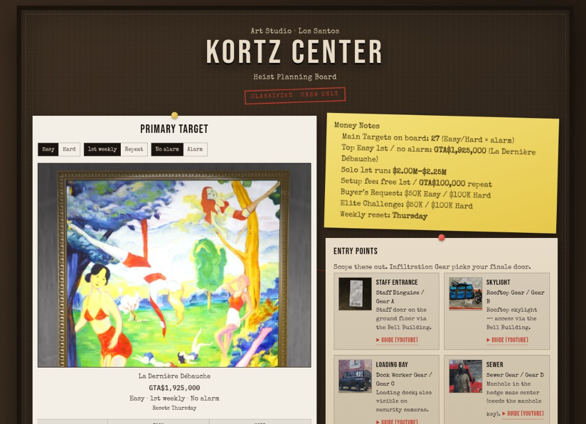

# Kortz Center Heist — Planning Board

> **Nota do autor:** este é um projeto pessoal pra **aprender Ruby on Rails** e, ao mesmo tempo, montar um guia visual do **Kortz Center Heist** (GTA Online) pra mim e pros meus amigos. É **fan-made, feito por fãs para fãs** — não é oficial e não tem afiliação com a Rockstar Games. Veja o [Disclaimer](#disclaimer) abaixo.

App em **Ruby on Rails 8** que recria o clima do **quadro de planejamento** do Art Studio: cork board, polaroids, post-its e pins — com os preços do main target (primeira run da semana vs buyer fatigue), secondary targets, entry points e prep missions.



---

## Por que esse projeto existe?

1. **Aprender Rails de verdade** — models, migrations, seeds, controllers, views ERB, helpers, rotas e CSS.
2. **Ajudar a crew** — ter num só lugar o que vale a pena na 1ª run da semana (reset quinta) e o que é armadilha de grind.
3. **Praticar design** — UI inspirada no planning board do jogo, não num dashboard genérico.

---

## Números que o app destaca (comunidade · jul/2026)

| Item | Valor |
| --- | --- |
| **La Dernière Débauche** — 1ª venda da semana | **GTA$1,925,000** |
| Mesma pintura — repeat (buyer fatigue) | GTA$481,250 |
| Setup fee | Grátis na 1ª / GTA$100,000 nas seguintes |
| Solo realista (1ª run + secondary) | ~GTA$2.0M – $2.25M |
| Crew 4 (máx. reportado, museu inteiro) | até ~GTA$7,143,000 |
| Buyer’s Request / Elite | $50k Normal · $100k Hard |
| Reset semanal | **Quinta-feira** |

Fonte principal: [GTA Wiki — Scope Out Kortz Center](https://gta.wiki/w/Scope_Out_Kortz_Center). Payouts também foram cruzados com Beebom, GTA Boom, GameRant, Crime Net Gazette e discussões da comunidade (incl. Reddit). **Sempre confirme in-game** depois de um patch.

---

## Como rodar

### Requisitos

- Ruby **3.4+** (testado com 3.4.9)
- Rails **8.1**
- SQLite

### Setup

```bash
# 1) Dependências
bundle install

# 2) Banco + seeds (cria tabelas e popula targets/preps/entradas)
bin/rails db:setup

# 3) Sobe o servidor (Puma + Tailwind watcher via bin/dev, se preferir)
bin/rails server
# ou:
bin/dev
```

Abra [http://localhost:3000](http://localhost:3000) — você cai direto no Planning Board.

### Comandos úteis pra estudar

```bash
bin/rails console          # IRB com models carregados
bin/rails db:seed          # re-popula os dados
bin/rails routes           # lista rotas
bin/rails db:migrate:status
```

---

## Estrutura (mapa mental Rails)

```
Request GET /
  → config/routes.rb          (root → planning_board#index)
  → PlanningBoardController   (busca Target, PrepMission, EntryPoint)
  → models/                   (regras + scopes)
  → views/planning_board/     (HTML do quadro)
  → helpers/                  (gta_money, pin_tilt, etc.)
```

| Pasta / arquivo | O que ensina |
| --- | --- |
| `app/models/*.rb` | ActiveRecord, validações, scopes |
| `db/migrate/` | Schema versionado |
| `db/seeds.rb` | Dados iniciais (payouts, preps) |
| `app/controllers/` | MVC — orquestra a página |
| `app/views/` | ERB + layout |
| `app/assets/stylesheets/planning_board.css` | Visual do board |
| `config/routes.rb` | URLs → actions |

O código está **cheio de comentários** de propósito — é material de estudo, não biblioteca “limpa demais”.

---

## Modelos

- **Target** — primary / secondary (nome, local, first weekly, repeat, peso na bolsa)
- **PrepMission** — mandatory / optional + dica de unlock no Scope Out
- **EntryPoint** — Staff, Skylight, Loading Bay, Sewer (+ gear)

---

## Disclaimer

Grand Theft Auto, GTA Online e marcas relacionadas são propriedade da **Rockstar Games** / **Take-Two Interactive**.

Este repositório é um projeto **fan-made, feito por fãs para fãs**, sem fins lucrativos, educacional e pra uso informal entre amigos. **Não é oficial** — não possui qualquer afiliação, endosso ou aprovação da Rockstar ou da Take-Two.

**Fontes**

- **Informações do heist** (targets, payouts, preps, entry points, etc.): [GTA Wiki — Scope Out Kortz Center](https://gta.wiki/w/Scope_Out_Kortz_Center)
- **Imagens dos primary targets**: [GTA Wiki — Main Targets](https://gta.wiki/w/Scope_Out_Kortz_Center#Main_Targets)

Se a Rockstar tiver qualquer preocupação com este projeto, entre em contato pelo [GitHub](https://github.com/suethttps) e eu retiro o site com prazer, respeitando as diretrizes deles.

---

Feito com café, cork board imaginário e vontade de aprender Rails.
